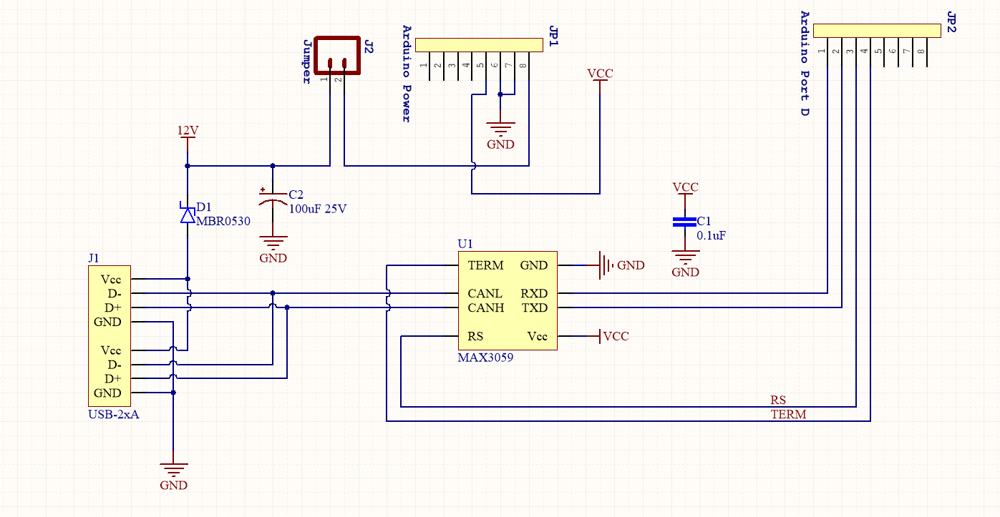
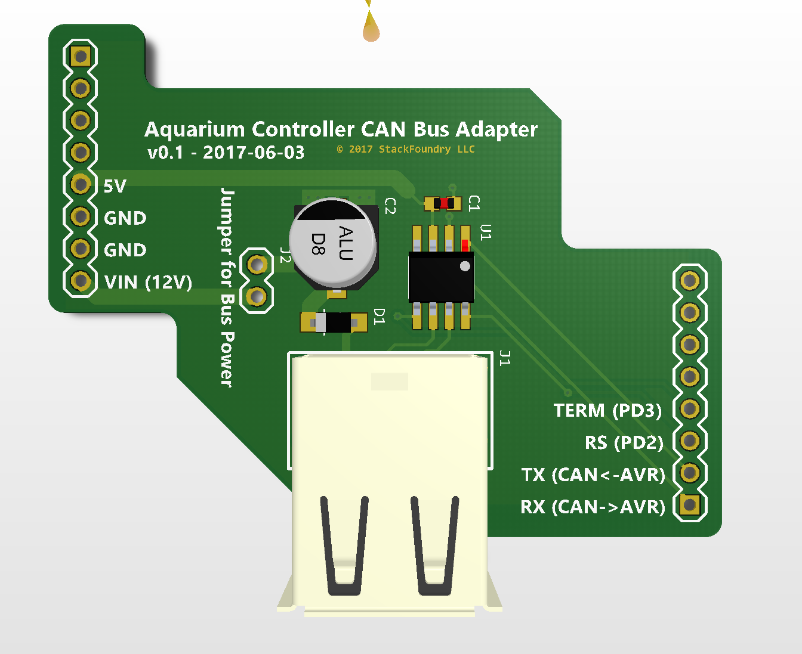
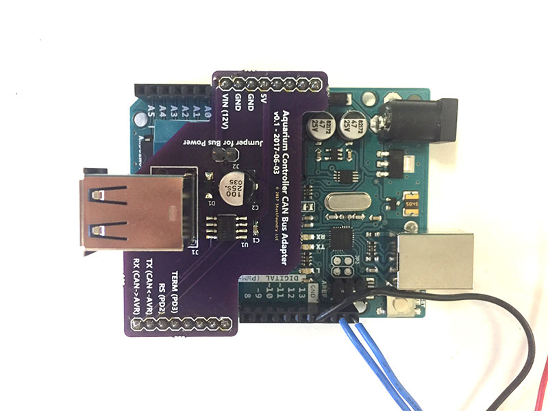

## AquaBus Arduino Adapter

@theatrus contributed the design of this adapter

Here's a handy adapter board that allows you to use an Arduino board to interact with your Neptune Apex or any of its modules:

AquaBus Arduino Adapter Schematics:

AquaBus Arduino Adapter layout:

AquaBus Arduino Adapter assembled:

[Adapter PCB on OSHPark](https://oshpark.com/shared_projects/xwEmx9A8)

Parts list (DigiKey Part #s):
- Qty 1 MBR0530CT-ND (optional, use if plan to power arduino via AquaBus)
- Qty 1 MAX3059ASA+-ND
- Qty 1 102-4001-ND
- Qty 1 PCE3898CT-ND (optional, use if plan to power arduino via AquaBus)
- 0.1uF 0603 capacitor, headers
